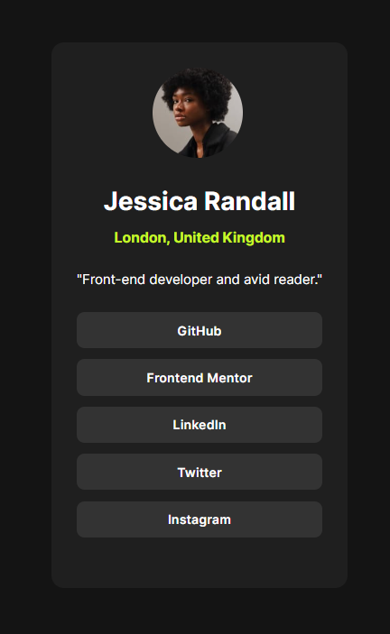

# Frontend Mentor - Social links profile solution

This is a solution to the [Social links profile challenge on Frontend Mentor](https://www.frontendmentor.io/challenges/social-links-profile-UG32l9m6dQ). Frontend Mentor challenges help you improve your coding skills by building realistic projects.

## Table of contents

- [Overview](#overview)
  - [The challenge](#the-challenge)
  - [Screenshot](#screenshot)
  - [Links](#links)
  - [Built with](#built-with)
- [Author](#author)

**Note: Delete this note and update the table of contents based on what sections you keep.**

## Overview

### The challenge

Users should be able to:

- See hover and focus states for all interactive elements on the page

### Screenshot

### Links

- Solution URL: [https://github.com/Devdainty/social-links-profile-main](https://github.com/Devdainty/social-links-profile-main)
- Live Site URL: [https://social-links-profile-main-five-jet.vercel.app/](https://social-links-profile-main-five-jet.vercel.app/)

## My process

### Built with

- Semantic HTML5 markup
- CSS custom properties
- Mobile-first workflow

## Author

- Website - [charles](https://social-links-profile-main-five-jet.vercel.app/)
- Frontend Mentor - [@devdainty](https://www.frontendmentor.io/profile/devdainty)
- Twitter - [@devdainty](https://www.twitter.com/devdainty)

**Note: Delete this note and add/remove/edit lines above based on what links you'd like to share.**
